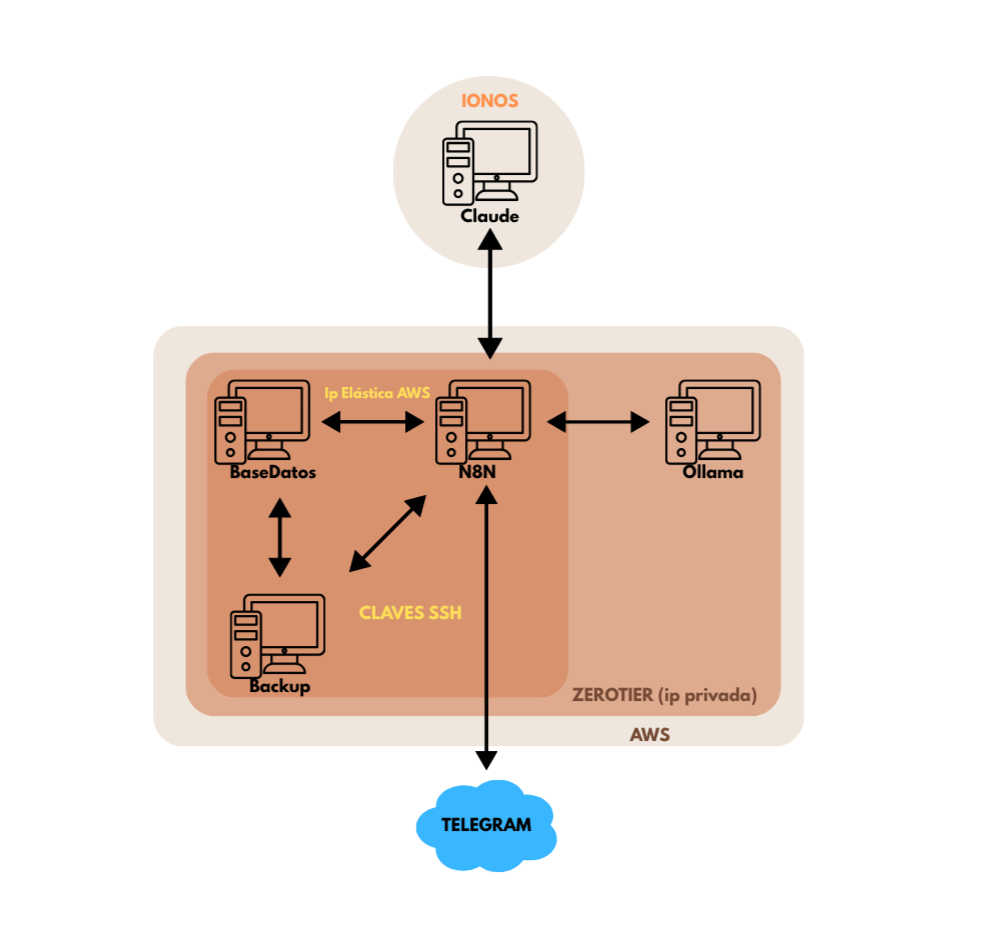

  <h1>Sistema de Gestión de Incidencias con n8n</h1>

  

Proyecto final del ciclo **ASIR (Administración de Sistemas Informáticos en Red)**

Desarrollado por: Natalia Barrera Aguilera

Curso 2024/2025

---

## 📁 Descripción del Proyecto

Este proyecto implementa un sistema automatizado para la gestión de incidencias utilizando **n8n**, una **herramienta de automatización de flujos de trabajo**. Los usuarios pueden reportar incidencias mediante un bot de Telegram, y estas se almacenan en una base de datos, se responden automáticamente con mensajes útiles generados por IA (Ollama) y se notifican a través de diferentes canales. Todo el sistema está desplegado en servidores AWS y un servidor propio en IONOS.

---

## 🏛️ Arquitectura del Sistema

  

---

## 📅 Flujo de Trabajo

- **n8n** actúa como motor de flujo para las automatizaciones.
- Se reciben mensajes desde Telegram a través del bot [@natillas_bot](http://t.me/natillas_bot).
- Se gestionan incidencias: alta, modificación de estado, y cierre.
- Respuestas enriquecidas mediante IA (Ollama).
- Actualización y consulta de incidencias mediante una interfaz CLI conectada al servidor IONOS.

---

## 📄 Funcionamiento

### Flujo en n8n

# Sistema de Gestión de Incidencias con n8n, Telegram y Ollama

Este sistema permite gestionar incidencias de forma automatizada y comunicativa, integrando flujos con **n8n**, interacción con **Telegram**, procesamiento con **Ollama** y acceso desde un **panel web de administración**.

## 1. Autenticación y flujo inicial con el bot

Cuando un usuario inicia una conversación con el bot de Telegram:

- Se valida su ID contra una lista autorizada. Esta verificación se realiza mediante una petición al servidor, garantizando que solo usuarios legítimos puedan continuar.
- Una vez autorizado, el usuario puede crear incidencias libremente.

## 2. Creación de la incidencia

- El usuario describe la incidencia directamente al bot.
- Una IA integrada con Ollama le hace preguntas complementarias para completar la información.
- Una vez finalizado el proceso, el ticket se registra automáticamente en la base de datos.
- Se confirma la creación de la incidencia con una respuesta automática del bot, incluyendo consejos iniciales proporcionados por la IA.

.jpeg)

## 3. Panel de administración web

- El panel muestra todas las incidencias registradas.
- Se puede **filtrar por estado**, buscar por usuario, palabra clave o fecha.
- Cada ticket se puede modificar, actualizar o eliminar desde la interfaz.

.PNG)

## 4. Gestión de actualizaciones

- Cuando un técnico cambia el estado de una incidencia desde el panel:
  - Se ejecuta un flujo en **n8n** que comunica el nuevo estado al usuario vía Telegram.
  - El mensaje incluye una nota opcional que el técnico puede escribir al cerrar la incidencia.
  - Esta nota queda registrada en la base de datos y es enviada automáticamente al usuario afectado.

.jpeg)

## 5. Ejecución automática de tareas

- Algunas incidencias específicas disparan tareas automatizadas como:
  - Backups remotos.
  - Escaneos de seguridad.
  - Scripts personalizados.
- Estas tareas se ejecutan desde n8n mediante SSH en las máquinas configuradas.

## 6. Interfaz de gestión en servidor IONOS

En el servidor IONOS se ha desarrollado una interfaz sencilla en la terminal (CLI) que permite:

- Listar todas las incidencias registradas.
- Modificar incidencias existentes.
- Añadir nuevas incidencias manualmente.

Esta interfaz fue generada con ayuda de una IA local (Claude) y funciona de forma segura gracias a la integración con **MCP Filesystem**, que restringe el acceso a archivos y comandos sensibles del sistema.

## 7. Registro completo y soporte con IA

- Cada acción queda registrada en la base de datos para su trazabilidad.
- Además, dependiendo del tipo de problema, se puede generar una respuesta adicional con Ollama para asesorar al usuario, incluso después del cierre.

### Conclusión

Este sistema ofrece una plataforma automatizada, segura y enriquecida con inteligencia artificial para gestionar incidencias técnicas, ofreciendo una experiencia ágil tanto para usuarios como para administradores.

---
## 🔧 Tecnologías utilizadas

* [n8n](https://n8n.io/) (automatización de flujos)
* [Telegram Bot API](https://core.telegram.org/bots)
* [Ollama](https://ollama.com/) (IA local para generar mensajes automáticos)
* MySQL (almacenamiento de incidencias)
* ZeroTier (conectividad privada entre servidores)
* Interfaz web generada con IA Claude
* Servidores IONOS y AWS (nube y hosting privado)

---

## 📖 Referencias

* [Documentación oficial de n8n](https://docs.n8n.io/)
* [API Bots Telegram](https://core.telegram.org/bots/api)
* [Ollama](https://ollama.com/)
* [ZeroTier](https://www.zerotier.com/)

---

**Autor:** Natalia Barrera Aguilera
