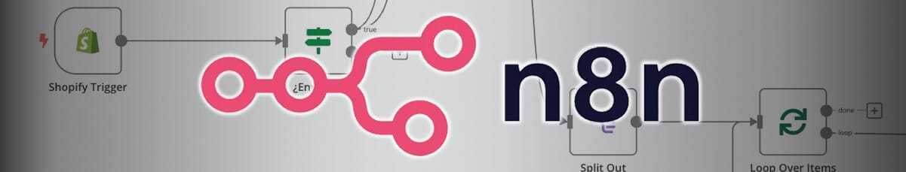
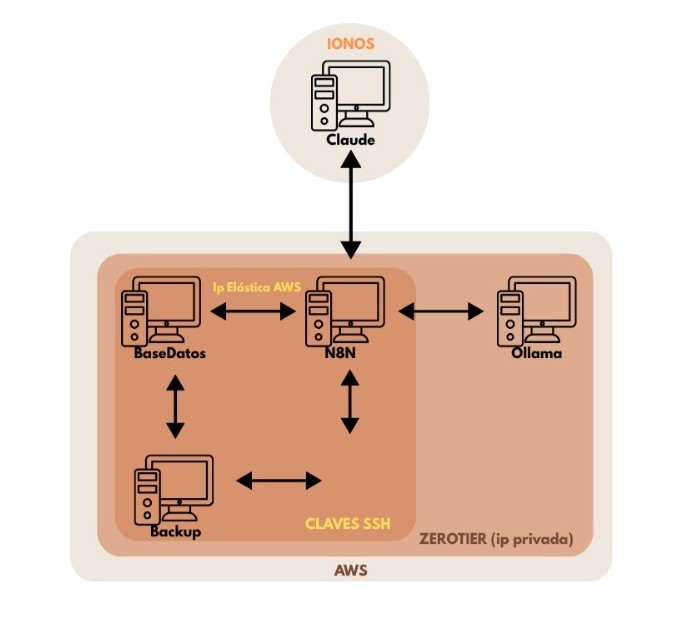

  <h1>Sistema de Gestión de Incidencias con n8n</h1>

  

Proyecto final del ciclo **ASIR (Administración de Sistemas Informáticos en Red)**

Desarrollado por: Natalia Barrera Aguilera

Curso 2024/2025

---

## 📁 Descripción del Proyecto

Este proyecto implementa un sistema automatizado para la gestión de incidencias utilizando **n8n**, una herramienta de automatización de flujos de trabajo. Los usuarios pueden reportar incidencias mediante un bot de Telegram, y estas se almacenan en una base de datos, se responden automáticamente con mensajes útiles generados por IA (Ollama) y se notifican a través de diferentes canales. Todo el sistema está desplegado en servidores AWS y un servidor propio en IONOS.

---

## 🏛️ Arquitectura del Sistema

  

---

## 📅 Flujo de Trabajo

1. El usuario contacta con `@natillas_bot` en Telegram.
2. El mensaje se recibe mediante un `Telegram Trigger` en n8n.
3. Se valida y registra la incidencia en MySQL.
4. Se genera una respuesta automática con IA (Ollama) ofreciendo consejos.
5. Se notifica al usuario y se crea el registro en el panel web.
6. El estado de la incidencia se puede actualizar, y el bot informa del cambio.

---

## 🔧 Tecnologías utilizadas

* [n8n](https://n8n.io/) (automatización de flujos)
* [Telegram Bot API](https://core.telegram.org/bots)
* [Ollama](https://ollama.com/) (IA local para generar mensajes automáticos)
* MySQL (almacenamiento de incidencias)
* ZeroTier (conectividad privada entre servidores)
* Interfaz web generada con IA Claude
* Servidores IONOS y AWS (nube y hosting privado)

---

## 📄 Capturas de funcionamiento

### Flujo en n8n

### Panel web personalizado

### Registro de incidencia con IA

### Notificación de estado actualizado

---

## 🔹 Funcionalidades implementadas

* [x] Registro de incidencias por Telegram
* [x] Generación de consejos automáticos con IA
* [x] Inserción en base de datos y respuesta al usuario
* [x] Panel web para ver, editar y cerrar tickets
* [x] Automatismo SSH para tareas programadas (copias de seguridad)
* [x] ZeroTier para red privada virtual

---

## 📖 Referencias

* [Documentación oficial de n8n](https://docs.n8n.io/)
* [API Bots Telegram](https://core.telegram.org/bots/api)
* [Ollama](https://ollama.com/)
* [ZeroTier](https://www.zerotier.com/)

---

**Autor:** Natalia Barrera Aguilera
