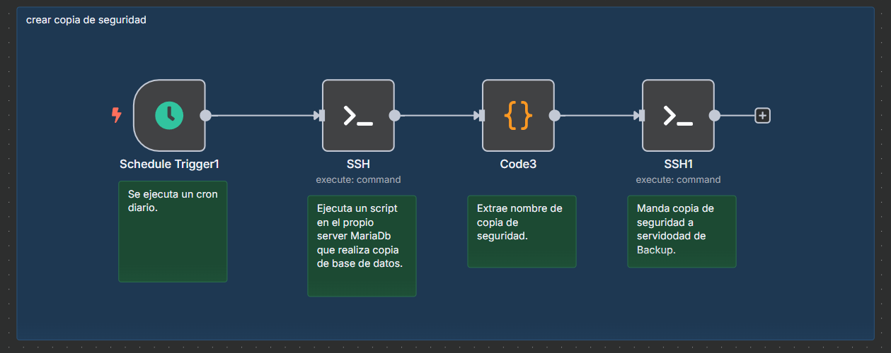

## 🛡️ Backup de la Base de Datos

Para proteger los datos del sistema de gestión de incidencias, se ha creado un script en Bash que genera copias de seguridad automáticas de la base de datos `gestion_incidencias`.

Este script se ejecuta mediante un **flujo de trabajo programado en n8n**, lo que permite lanzar backups diarios sin intervención manual.

### 📁 Script

```bash
#!/bin/bash

# CONFIGURACIÓN
DB_USER="usuario_n8n"
DB_PASS="natalia"
DB_NAME="gestion_incidencias"
BACKUP_DIR="/home/admin/db_backups"
TIMESTAMP=$(date +"%Y%m%d_%H%M%S")
BACKUP_NAME="${DB_NAME}_$TIMESTAMP.sql"
BACKUP_PATH="$BACKUP_DIR/$BACKUP_NAME"

# Crear directorio si no existe
mkdir -p "$BACKUP_DIR"

# Realizar el backup
mysqldump -u $DB_USER -p"$DB_PASS" $DB_NAME > "$BACKUP_PATH"

# Comprimir el archivo resultante
gzip "$BACKUP_PATH"

# Mostrar la ruta del backup generado
echo "${BACKUP_PATH}.gz"
```

---

### 🔄 Automatización en n8n

El proceso de copia de seguridad está totalmente automatizado mediante el siguiente flujo en n8n:

<p align="center">
  
</p>

#### 🧹 Estructura del flujo

1. **Schedule Trigger1**
   Ejecuta el flujo automáticamente cada día (cron diario).

2. **SSH (nodo 1)**
   Lanza por SSH el script en el servidor donde se aloja MariaDB, generando una copia de la base de datos comprimida (`.sql.gz`).

3. **Code3**
   Extrae el nombre del archivo generado (por ejemplo, para crear rutas dinámicas o pasarlo al siguiente paso).

4. **SSH1**
   Transfiere el archivo comprimido al servidor de backup remoto a través de SCP mediante SSH.

Este flujo garantiza que cada día se genere una copia automática de la base de datos y se almacene externamente, sin depender de ejecución manual.
